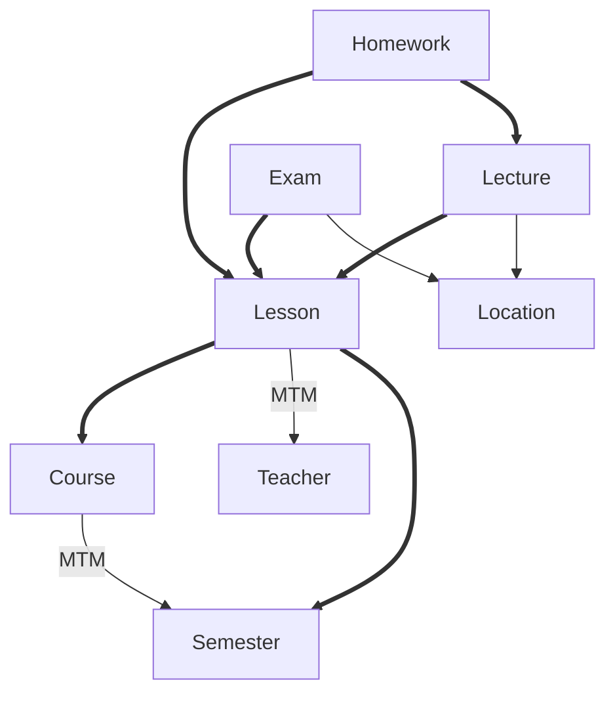

# Database Schema

Core logic

```mermaid
graph TD
    Lesson ==> Course
    Lesson -- MTM --> Teacher
    Lesson ==> Semester

    Course -- MTM --> Semester

    Lecture ==> Lesson
    Lecture --> Location

    Homework ==> Lesson
    Homework ==> Lecture

    Exam ==> Lesson
    Exam --> Location
```
