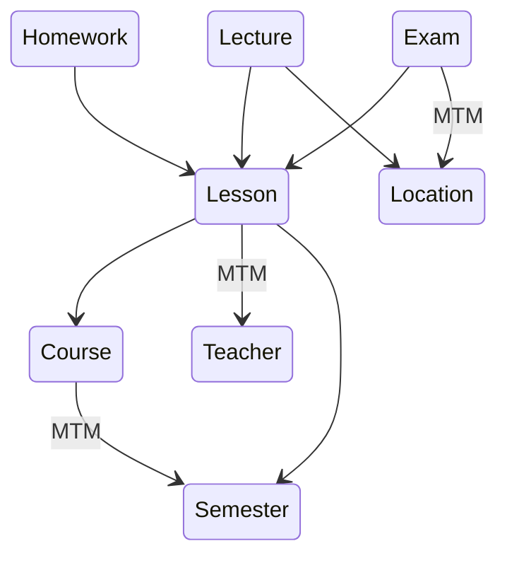
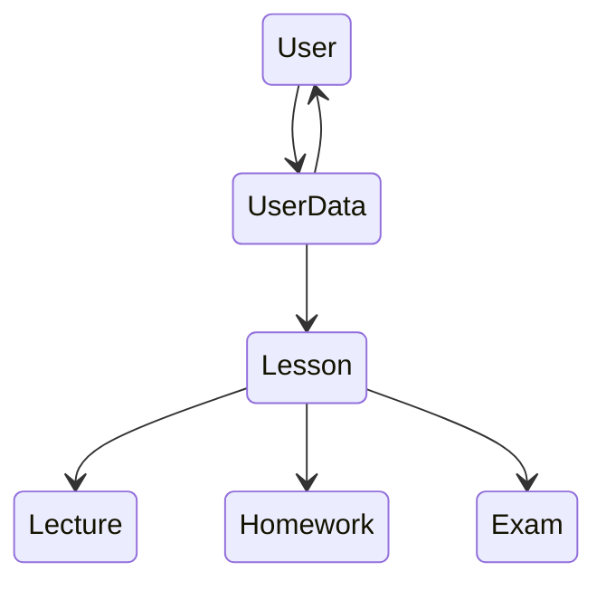
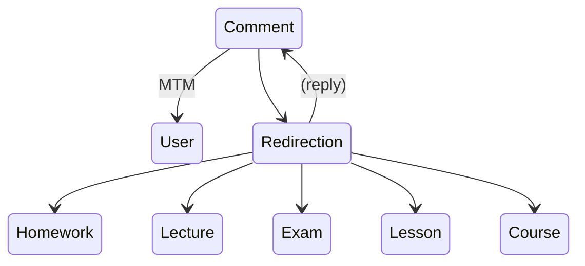

# Database Schema

Core logic

```mermaid
stateDiagram-v2
    Lesson --> Course
    Lesson --> Teacher : MTM
    Lesson --> Semester

    Course --> Semester : MTM

    Lecture --> Lesson
    Lecture --> Location

    Homework --> Lesson

    Exam --> Lesson
    Exam --> Location : MTM
```

Users

```mermaid
stateDiagram-v2
    User --> UserData
    UserData --> User

    UserData --> Lesson

    Lesson --> Lecture
    Lesson --> Homework
    Lesson --> Exam
```

Comments (**NOT IMPLEMENTED**)

```mermaid
stateDiagram-v2
    Comment --> User : MTM

    Comment --> Redirection
    Redirection --> Comment : (reply)

    Redirection --> Homework
    Redirection --> Lecture
    Redirection --> Exam
    Redirection --> Lesson
    Redirection --> Course
```
