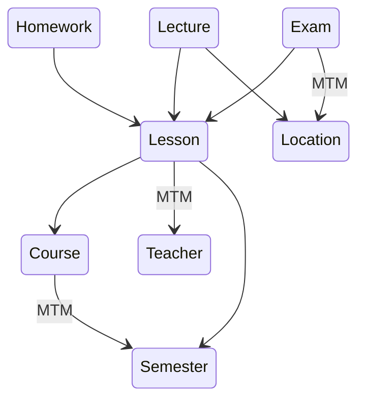
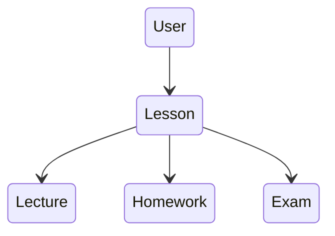
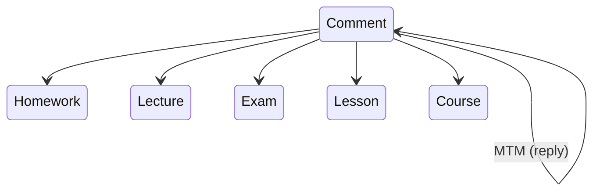

# Database Schema

Core logic

```mermaid
stateDiagram-v2
    Lesson --> Course
    Lesson --> Teacher : MTM
    Lesson --> Semester

    Course --> Semester : MTM

    Lecture --> Lesson
    Lecture --> Location

    Homework --> Lesson

    Exam --> Lesson
    Exam --> Location : MTM
```

Users

```mermaid
stateDiagram-v2
    User --> Lesson

    Lesson --> Lecture
    Lesson --> Homework
    Lesson --> Exam
```

Comments:

```mermaid
stateDiagram-v2
    Comment --> Homework
    Comment --> Lecture
    Comment --> Exam
    Comment --> Lesson
    Comment --> Course
    Comment --> Comment : MTM (reply)

```
